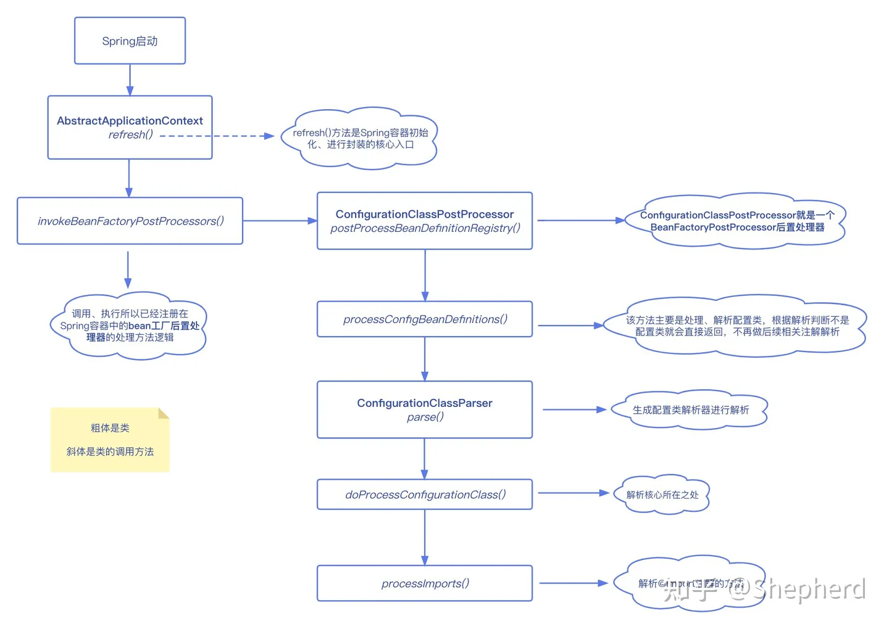

# @Import使用及原理详解

[参考文档](https://zhuanlan.zhihu.com/p/618418058)

## @Import 是什么

@Import 是 Spring 基于 Java 注解配置的主要组成部分

@Import 注解提供了类似 @Bean 注解的功能，向Spring容器中注入bean，也对应实现了与Spring XML中的<import/>元素相同的功能

```java

@Target(ElementType.TYPE)
@Retention(RetentionPolicy.RUNTIME)
@Documented
public @interface Import {

    /**
     * {@link Configuration @Configuration}, {@link ImportSelector},
     * {@link ImportBeanDefinitionRegistrar}, or regular component classes to import.
     */
    Class<?>[] value();

}
```

看着很简单，实际上，这个类对象有三种用法

- 普通类
- 实现了ImportSelector接口的类（这是重点~Spring Boot的自动配置原理就用到这种方式）
- 实现了ImportBeanDefinitionRegistrar接口的类

## @Import 三种用法

### 注入普通类

我们定义几个类尝试一下

```java
import lombok.AllArgsConstructor;
import lombok.Builder;
import lombok.Data;
import lombok.NoArgsConstructor;

@Data
@AllArgsConstructor
@NoArgsConstructor
@Builder
public class Person {
    private Long id;
    private String name;
    private Integer age;
}
```

```java

@Data
public class Student {
    private Long id;
    private String name;
    private Integer age;
}
```

```java
import org.springframework.context.annotation.AnnotationConfigApplicationContext;
import org.springframework.context.annotation.Bean;
import org.springframework.context.annotation.Configuration;
import org.springframework.context.annotation.Import;

@Configuration
@Import({Student.class})
public class MyConfig {

    @Bean
    public Person person01() {
        Person person = Person.builder().id(1l).name("shepherd").age(25).build();
        return person;
    }


    public static void main(String[] args) {
        AnnotationConfigApplicationContext applicationContext = new AnnotationConfigApplicationContext(MyConfig.class);
        String[] beanDefinitionNames = applicationContext.getBeanDefinitionNames();
        // 遍历Spring容器中的beanName
        for (String beanDefinitionName : beanDefinitionNames) {
            System.out.println(beanDefinitionName);
        }
    }

}
```

执行结果

```text
org.springframework.context.annotation.internalConfigurationAnnotationProcessor
org.springframework.context.annotation.internalAutowiredAnnotationProcessor
org.springframework.context.annotation.internalCommonAnnotationProcessor
org.springframework.context.event.internalEventListenerProcessor
org.springframework.context.event.internalEventListenerFactory
myConfig
com.pwx.entity.Student
person01
```

可以看到，@Import({Student.class})把Student类注入到了Spring容器中，beanName默认为全限定类名

而@Bean注入的默认为方法名，这也是两者的区别

并且我们的myConfig类也被注册到Bean里面了。（先玩后看）

### 实现了ImportSelector接口的类

这一方式比较重要，也可以说是@Import最常用的方式，Spring Boot的自动装配原理就用到了这种方式

```java
public interface ImportSelector {

    /**
     * Select and return the names of which class(es) should be imported based on
     * the {@link AnnotationMetadata} of the importing @{@link Configuration} class.
     * @return the class names, or an empty array if none
     */
    String[] selectImports(AnnotationMetadata importingClassMetadata);

    /**
     * Return a predicate for excluding classes from the import candidates, to be
     * transitively applied to all classes found through this selector's imports.
     * <p>If this predicate returns {@code true} for a given fully-qualified
     * class name, said class will not be considered as an imported configuration
     * class, bypassing class file loading as well as metadata introspection.
     * @return the filter predicate for fully-qualified candidate class names
     * of transitively imported configuration classes, or {@code null} if none
     * @since 5.2.4
     */
    @Nullable
    default Predicate<String> getExclusionFilter() {
        return null;
    }

}
```

- selectImports( )返回一个包含了类全限定名的数组，这些类会注入到Spring容器当中。注意如果为null，要返回空数组，不然后续处理会报错空指针
- getExclusionFilter()该方法制定了一个对类全限定名的排除规则来过滤一些候选的导入类，默认不排除过滤。该接口可以不实现

我们举个例子

```java
public class RoleImportSelector implements ImportSelector {

    @Override
    public String[] selectImports(AnnotationMetadata importingClassMetadata) {
        return new String[]{"com.pwx.entity.Role"};
    }
}
```

```java

@Import({RoleImportSelector.class})
public class ImportAutoConfig {
}
```

执行结果

```text
beanName = importAutoConfig
beanName = com.pwx.entity.Role
```

这里可以看到，RoleImportSelector并没有被当做一个普通类进行处理，并且也没有被注入到Bean中

而selectImports()返回的全限定类名数组批量注入到Spring容器中

### 实现了ImportBeanDefinitionRegistrar接口的类

这种方式通过描述就可以知道是通过实现ImportBeanDefinitionRegistrar将要注入的类添加到BeanDefinition注册中心，这样Spring 后续会根据bean定义信息将类注入到容器中。

```java
public interface ImportBeanDefinitionRegistrar {

    /**
     * Register bean definitions as necessary based on the given annotation metadata of
     * the importing {@code @Configuration} class.
     * <p>Note that {@link BeanDefinitionRegistryPostProcessor} types may <em>not</em> be
     * registered here, due to lifecycle constraints related to {@code @Configuration}
     * class processing.
     * <p>The default implementation delegates to
     * {@link #registerBeanDefinitions(AnnotationMetadata, BeanDefinitionRegistry)}.
     * @param importingClassMetadata annotation metadata of the importing class
     * @param registry current bean definition registry
     * @param importBeanNameGenerator the bean name generator strategy for imported beans:
     * {@link ConfigurationClassPostProcessor#IMPORT_BEAN_NAME_GENERATOR} by default, or a
     * user-provided one if {@link ConfigurationClassPostProcessor#setBeanNameGenerator}
     * has been set. In the latter case, the passed-in strategy will be the same used for
     * component scanning in the containing application context (otherwise, the default
     * component-scan naming strategy is {@link AnnotationBeanNameGenerator#INSTANCE}).
     * @since 5.2
     * @see ConfigurationClassPostProcessor#IMPORT_BEAN_NAME_GENERATOR
     * @see ConfigurationClassPostProcessor#setBeanNameGenerator
     */
    default void registerBeanDefinitions(AnnotationMetadata importingClassMetadata, BeanDefinitionRegistry registry,
                                         BeanNameGenerator importBeanNameGenerator) {

        registerBeanDefinitions(importingClassMetadata, registry);
    }

    /**
     * Register bean definitions as necessary based on the given annotation metadata of
     * the importing {@code @Configuration} class.
     * <p>Note that {@link BeanDefinitionRegistryPostProcessor} types may <em>not</em> be
     * registered here, due to lifecycle constraints related to {@code @Configuration}
     * class processing.
     * <p>The default implementation is empty.
     * @param importingClassMetadata annotation metadata of the importing class
     * @param registry current bean definition registry
     */
    default void registerBeanDefinitions(AnnotationMetadata importingClassMetadata, BeanDefinitionRegistry registry) {
    }

}
```

可以看到一共有两个同名重载方法，都是用于将类的BeanDefinition注入。

唯一的区别就是，2个参数的方法，只能手动的输入beanName，而3个参数的方法，可以利用BeanNameGenerator根据beanDefinition自动生成beanName

```java
public class PermissionImportBeanDefinitionRegistrar implements ImportBeanDefinitionRegistrar {

    @Override
    public void registerBeanDefinitions(AnnotationMetadata importingClassMetadata, BeanDefinitionRegistry registry) {
        RootBeanDefinition rootBeanDefinition = new RootBeanDefinition(Permission.class);
        // 注册一个名字叫permission的bean定义
        registry.registerBeanDefinition("permission123", rootBeanDefinition);
    }


/*    @Override
    public void registerBeanDefinitions(AnnotationMetadata importingClassMetadata, BeanDefinitionRegistry registry, BeanNameGenerator importBeanNameGenerator) {
        RootBeanDefinition beanDefinition = new RootBeanDefinition(Permission.class);
        String beanName = importBeanNameGenerator.generateBeanName(beanDefinition, registry);
        registry.registerBeanDefinition(beanName, beanDefinition);
    }*/
}
```

注意，这里只能注入一个bean，所以只能实现一个方法进行注入，如果两个都是实现，前面的一个方法生效。

## @Import的实现原理

@Import 的核心类还是ConfigurationClassPostProcessor，这个和我们上一期讲的[@Configuration 和 @Component区别]()一样



我们直接跳到最核心的 processImports(configClass, sourceClass, getImports(sourceClass), filter, true)

```java
private void processImports(ConfigurationClass configClass, SourceClass currentSourceClass,
		Collection<SourceClass> importCandidates, Predicate<String> exclusionFilter,
		boolean checkForCircularImports) {

	if (importCandidates.isEmpty()) {
		return;
	}
    //循环注入的检查
	if (checkForCircularImports && isChainedImportOnStack(configClass)) {
		this.problemReporter.error(new CircularImportProblem(configClass, this.importStack));
	}
	else {
		this.importStack.push(configClass);
		try {
			for (SourceClass candidate : importCandidates) {
                //如果是实现了ImportSelector接口的类
				if (candidate.isAssignable(ImportSelector.class)) {
					// Candidate class is an ImportSelector -> delegate to it to determine imports
					Class<?> candidateClass = candidate.loadClass();
					ImportSelector selector = ParserStrategyUtils.instantiateClass(candidateClass, ImportSelector.class,
							this.environment, this.resourceLoader, this.registry);
					Predicate<String> selectorFilter = selector.getExclusionFilter();
					if (selectorFilter != null) {
                        //过滤注入的类
						exclusionFilter = exclusionFilter.or(selectorFilter);
					}
                    // 延迟注入
					if (selector instanceof DeferredImportSelector) {
						this.deferredImportSelectorHandler.handle(configClass, (DeferredImportSelector) selector);
					}
					else {
                        //调用selector当中的selectImports方法，得到要注入的类的全限定名
						String[] importClassNames = selector.selectImports(currentSourceClass.getMetadata());
						Collection<SourceClass> importSourceClasses = asSourceClasses(importClassNames, exclusionFilter);
						// 递归
                        processImports(configClass, currentSourceClass, importSourceClasses, exclusionFilter, false);
					}
				}
                //如果是ImportBeanDefinitionRegistrar 则configClass.addImportBeanDefinitionRegistrar 提前放到一个map当中
				else if (candidate.isAssignable(ImportBeanDefinitionRegistrar.class)) {
					// Candidate class is an ImportBeanDefinitionRegistrar ->
					// delegate to it to register additional bean definitions
					Class<?> candidateClass = candidate.loadClass();
					ImportBeanDefinitionRegistrar registrar =
							ParserStrategyUtils.instantiateClass(candidateClass, ImportBeanDefinitionRegistrar.class,
									this.environment, this.resourceLoader, this.registry);
					configClass.addImportBeanDefinitionRegistrar(registrar, currentSourceClass.getMetadata());
				}
				else {
                    // 如果是普通类
					// Candidate class not an ImportSelector or ImportBeanDefinitionRegistrar ->
					// process it as an @Configuration class
					this.importStack.registerImport(
							currentSourceClass.getMetadata(), candidate.getMetadata().getClassName());
					processConfigurationClass(candidate.asConfigClass(configClass), exclusionFilter);
				}
			}
		}
		catch (BeanDefinitionStoreException ex) {
			throw ex;
		}
		catch (Throwable ex) {
			throw new BeanDefinitionStoreException(
					"Failed to process import candidates for configuration class [" +
					configClass.getMetadata().getClassName() + "]", ex);
		}
		finally {
			this.importStack.pop();
		}
	}
}
```
总结一下:

- 实现了ImportSelector接口的类，调用getExclusionFilter()方法，如果不为空，那么就进行过滤，过滤后调用selectImports()方法，得到要注入的类的全限定名。根据类全限定名，得到类元信息。然后递归的调用processImports()方法
- 实现了ImportBeanDefinitionRegistrar接口的类，会实例化这个类，放入集合importBeanDefinitionRegistrars当中
- 普通类型的类（上面两个都不满足），那么就把它当作是配置类来处理，调用processConfigurationClass()方法，最终会放入到configurationClasses这个集合当中。
- 经过一系列的递归调用，实现了ImportBeanDefinitionRegistrar接口的类，会放入到importBeanDefinitionRegistrars集合当中，其余的类都放入到configurationClasses集合当中
- 最后，我们通过代码可以看到，到了ConfigurationClassPostProcessor中的this.reader.loadBeanDefinitions(configClasses);将configurationClasses集合当中类加载的Spring容器当中，并且从 importBeanDefinitionRegistrars缓存当中拿到所有的ImportBeanDefinitionRegistrar并执行registerBeanDefinitions方法。
